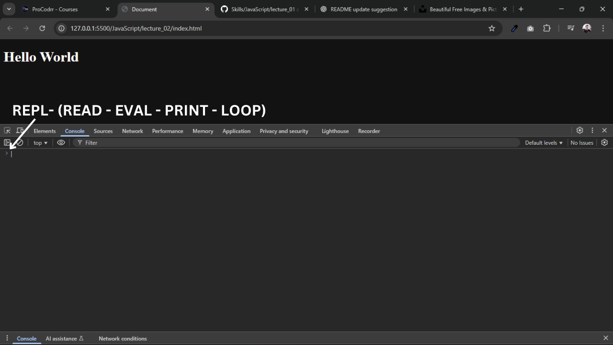

# What is REPL ?
A REPL, or Read-Eval-Print Loop, is an interactive programming environment that allows developers to execute code snippets line-by-line and see immediate results.

STEPS:

    1. Read: The REPL reads a command that you've entered.
    2. Eval: The system evaluates (executes) that command.
    3. Print: The result of the execution is printed back to you.
    4. Loop: The process then repeats, waiting for your next input.



## Example of REPL
```js
console.log("Hello World");
```
for this console.log():

    R = Reading the code
    E = Nothing to Evaluate ex.(5 + 8)
    P = Printing the value (Hello World)
    L = And ready for next command


```js
console.log(5 + 8)
```
for this code:

    R = Reading the code
    E = Evaluate the code
    P = Printing the value (12)
    L = And ready for next command

---

# How to print text

In JavaScript we use console.log() for printing in console or terminal.

```js
console.log("Hello World")
```

## process of how this console.log() value prints on console or terminal.

This is our html code:
```html
<!DOCTYPE html>
<html lang="en">
<head>
    <meta charset="UTF-8">
    <meta name="viewport" content="width=device-width, initial-scale=1.0">
    <title>Document</title>
    <script src="script.js"></script>
</head>
<body>
    <h1>Hello World</h1>
</body>
</html>
```

And this is our JavaScript code:
```js
console.log("Hello World");
```

so lets see how its work 

    Steps how this works:
    1. when we start our porject through live server its serves our porject to the browser through network.
    2. then browser start executing code line by line.
    3. so browser start executing line number 1 which is <!DOCTYPE html>
    4. then its move to the next line and then next.
    5. then its come to title code when it's execute this line browser title is visible.
    6. and then now its come to script code where javascript file is linked so when it see this code its make request to the server that i want this file.
    7. now server give him a response with that file.
    8. now browser start reading that file if file is very huge so next line could not execute untill complete file executed (if script file does not have defer or type attribute or it's on head tag not in body).
    9. then console.log() text print and next line start executing.

use defer attribute if you don't want that my html execution stop while script file responses. script content show after html execution complete.

## Guess the answer
```js
console.log(4 + 2 - 6)
```
its answer is 0

because 4 + 2 = 6
and 6 - 6  = 0

```js
console.log(4 - 2 + 6)
```
its answer is 8

because 4 - 2 = 2
and 2 + 6 = 8

```js 
console.log(4 + 3 - 4 * 2)
```
its answer is -1

because 4 * 2 = 8
and 4 + 3 = 7
and then 7 - 8 = -1

```js
console.log(4 - 3 + 5 \ 2 * 4)
```
its answer is 11

because 5 \ 2 = 2.5
and 2.5 * 4 = 10
then 4 - 3 = 1
and then 1 + 10 = 11

JavaScript follows operator precedence (the order in which operators are executed):

Division (/) and Multiplication (*) are evaluated first (from left to right).

Then Addition (+) and Subtraction (-) are evaluated (also left to right).

but if you want to execute specific value first so simply wrap it under ().

```js
console.log(4 - (6 + 8))
```
its answer is -10

because now + value execute first because its in ()

so 6 + 8 = 14

then 4 - 14 = -10 

because its evaluate left to right